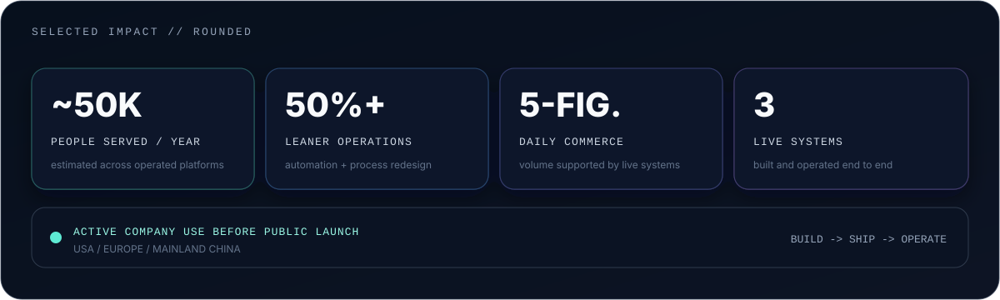

<!-- README_PROFILE_VERSION: 3 -->

<p align="center">
  
</p>

<p align="center"><sub>Impact figures are rounded or estimated from operational volume to protect confidential commercial data.</sub></p>

```text
current_focus:   production-hardening YiTaiCOS
side_quests:     HasiFlow / TerraMachina / BlogposterCMS
live_systems:    YiTaiCOS / StampArtisan / Keramik Girola
next_project:    yours?
```

**I build production systems where AI, commerce, operations, growth, and simulation collide.**  
Multi-tenant SaaS, China-ready cloud infrastructure, commerce automation, growth engineering, AI-native products, and deterministic C++ game engine R&D -- designed, shipped, and operated end to end.

## things that escaped localhost

It usually starts as a small idea. Then it grows architecture, infrastructure, operations, documentation -- and eventually becomes something people actually use.

<table>
  <tr>
    <td width="50%" valign="top">
      <h3><a href="https://yitaicos.cn">YiTaiCOS</a></h3>
      <p><strong>A production-grade business OS already in active company use.</strong></p>
      <p>An AI-ready, multi-tenant operations platform spanning order orchestration, fulfillment, CRM, inventory, suppliers, finance, files, and workforce workflows. Currently completing production hardening and a dedicated cloud-delivery architecture for Mainland China.</p>
      <p><code>Multi-tenant SaaS</code> <code>ERP / CRM</code> <code>Event-driven workflows</code> <code>RBAC</code> <code>China-ready cloud</code></p>
    </td>
    <td width="50%" valign="top">
      <h3><a href="https://hasiflow.com">HasiFlow</a></h3>
      <p><strong>The AI-native fitness side quest that became a platform.</strong></p>
      <p>A cross-platform fitness and nutrition product combining AI-assisted coaching, structured user data, Firebase services, Android distribution, and a published ChatGPT app.</p>
      <p><code>AI-native product</code> <code>Flutter</code> <code>Firebase</code> <code>LLM integration</code> <code>Mobile</code></p>
    </td>
  </tr>
  <tr>
    <td width="50%" valign="top">
      <h3><a href="https://stampartisan.com">StampArtisan</a></h3>
      <p><strong>Composable commerce, but all the way down.</strong></p>
      <p>A live international commerce system I built and operate end to end: storefront, conversion-focused UX, theme architecture, extensions, integrations, automation, and a dedicated Shopify app.</p>
      <p><code>Shopify engineering</code> <code>Commerce automation</code> <code>App development</code> <code>Revenue operations</code></p>
    </td>
    <td width="50%" valign="top">
      <h3><a href="https://keramikgirola.ch">Keramik Girola</a></h3>
      <p><strong>Digital transformation for a real business, not a mock-up.</strong></p>
      <p>End-to-end platform architecture, experience design, migration, custom plugins, business integrations, and ongoing digital operations for a Basel ceramics and natural-stone company.</p>
      <p><code>Platform modernization</code> <code>WordPress engineering</code> <code>Custom plugins</code> <code>Digital operations</code></p>
    </td>
  </tr>
</table>

## side quests that got serious

- **[BlogposterCMS](https://github.com/BlogposterCMS/BlogposterCMS)** -- an open-source modular CMS platform with a visual design studio, plugin architecture, structured content, RBAC, automated testing, and developer tooling.
- **TerraMachina** -- advanced C++ game engine R&D exploring deterministic simulation, hierarchical worlds, procedural systems, matter, emergent life, persistence, and replay.

## under the hood

- **Product & AI** -- AI-native applications, LLM integrations, workflow automation, and human-in-the-loop systems
- **Platform architecture** -- multi-tenant SaaS, API design, event-driven workflows, RBAC, and domain-driven data models
- **Cloud & delivery** -- Docker, CI/CD, AWS services, AliCloud, Vercel, Firebase, and Mainland China infrastructure
- **Growth & commerce** -- Google Ads, paid acquisition, conversion tracking, Shopify apps, cross-border commerce, and revenue operations
- **Content platforms** -- WordPress plugins, CMS architecture, visual builders, and digital operations
- **Simulation & engine R&D** -- modern C++, deterministic simulation, procedural systems, persistence, and replay

<p align="center">
  <a href="https://vicari.one"><strong>vicari.one</strong></a>
  &nbsp;/&nbsp;
  <em>some systems are public. the bigger ones usually are not.</em>
</p>
