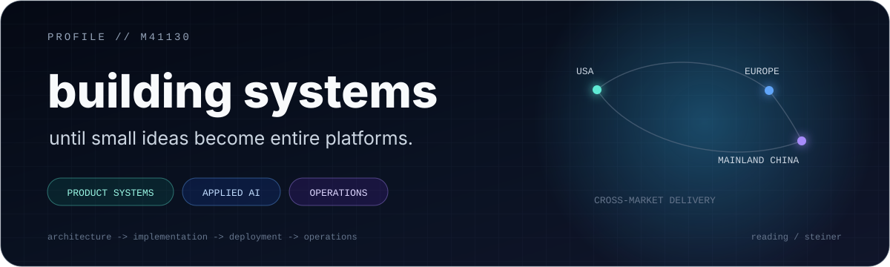

<!-- README_PROFILE_VERSION: 2 -->

<p align="center">
  
</p>

```text
current_focus:   production-hardening YiTaiCOS
side_quests:     HasiFlow / TerraMachina / BlogposterCMS
live_systems:    YiTaiCOS / StampArtisan / Keramik Girola
next_project:    yours?
```

<p align="center">
  
</p>

<p align="center">
  
</p>

<p align="center"><sub>Impact figures are rounded or estimated from operational volume to protect confidential commercial data.</sub></p>

## things that escaped localhost

It usually starts as a small idea. Then it grows architecture, infrastructure, operations, documentation -- and eventually becomes something people actually use.

<table>
  <tr>
    <td width="50%" valign="top">
      <h3>YiTaiCOS</h3>
      <p><strong>Active company use before public launch.</strong></p>
      <p>A private multi-tenant operations platform spanning orders, fulfillment, CRM, inventory, suppliers, finance, files, and personnel. I am finishing its production hardening and a dedicated delivery route for Mainland China.</p>
      <p><code>Next.js</code> <code>PostgreSQL</code> <code>Docker</code> <code>AliCloud</code> <code>EN/ZH</code></p>
    </td>
    <td width="50%" valign="top">
      <h3><a href="https://hasiflow.com">HasiFlow</a></h3>
      <p><strong>The fitness side quest that became a platform.</strong></p>
      <p>AI-assisted fitness and nutrition across Flutter, Firebase, backend services, Android distribution, and a published ChatGPT app. Still evolving whenever the other projects leave me time.</p>
      <p><code>Flutter</code> <code>Firebase</code> <code>OpenAI</code> <code>Android</code></p>
    </td>
  </tr>
  <tr>
    <td width="50%" valign="top">
      <h3><a href="https://stampartisan.com">StampArtisan</a></h3>
      <p><strong>Shopify, but all the way down.</strong></p>
      <p>A live commerce business I built and operate: storefront, theme architecture, extensions, integrations, and a dedicated Shopify app.</p>
      <p><code>Shopify</code> <code>Liquid</code> <code>App development</code> <code>Operations</code></p>
    </td>
    <td width="50%" valign="top">
      <h3><a href="https://keramikgirola.ch">Keramik Girola</a></h3>
      <p><strong>A real business, not a portfolio mock-up.</strong></p>
      <p>Architecture, design, migration, custom plugins, and ongoing operation for a Basel ceramics and natural-stone company.</p>
      <p><code>WordPress</code> <code>PHP</code> <code>Custom plugins</code> <code>Operations</code></p>
    </td>
  </tr>
</table>

## side quests that got serious

- **[BlogposterCMS](https://github.com/BlogposterCMS/BlogposterCMS)** -- an open-source modular Node.js CMS with a visual design studio, structured content, permissions, tests, and developer tooling.
- **TerraMachina** -- my slightly unreasonable C++ experiment in deterministic physical systems, hierarchical worlds, matter, emergent life, persistence, and replay.

## under the hood

`TypeScript` / `Node.js` / `Next.js` / `React` / `Flutter` / `Firebase` / `PostgreSQL` / `Supabase` / `Docker` / `AWS` / `AliCloud` / `Vercel` / `Shopify` / `WordPress` / `OpenAI` / `C++`

<p align="center">
  <a href="https://vicari.one"><strong>vicari.one</strong></a>
  &nbsp;/&nbsp;
  <em>some systems are public. the bigger ones usually are not.</em>
</p>
